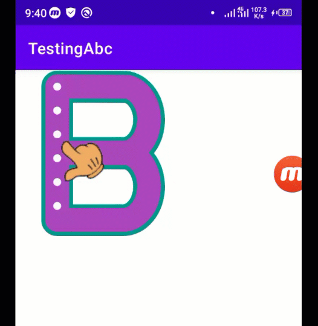

## Android Word Tracing SDK
 Android Word/Letter Tracing SDK is a complet solution to build apps for kids learning in pure kotlin. It supports all kind of shapes and all language letters e.g. english, arabic, Urdu, hindi etc.


###  Getting Started
Step 1: Include it in your settings.gradle
```
	allprojects {
		repositories {
			...
			maven { url 'https://jitpack.io' }
		}
	}
```
Step 2: Include it in app gradle
```
	        implementation 'com.github.farimarwat:android-word-tracing-sdk:1.1'
```

### XML Example
```
 <pk.farimarwat.abckids.TracingLetterView
       android:id="@+id/tlview"
       android:layout_width="wrap_content"
       android:layout_height="wrap_content"
       app:layout_constraintStart_toStartOf="parent"
       app:layout_constraintEnd_toEndOf="parent"
       app:layout_constraintTop_toTopOf="parent"
       
       />
```

#### Custom Attributes
|  Attribute | Details   |
| ------------ | ------------ |
|  app:tlv_segmentfillimage | Drawable image for fill while moving finger  |
| app:tlv_segmentfillcolor | Fill color while moving finger (Note: Use either fill color or image) |
|  app:tlv_indicator | Drawable png image e.g. hand indication image  |
|  app:tlv_segmentbordercolor | Border color for shape  |
|   app:tlv_segmentbackgroundcolor | Background color for shape  |
| app:tlv_segmentdot | Dots color on shape |
| app:tlv_segmentsize | Segment size for shape |


### Kotlin Code
```kotlin
val width = 420
val height = 420

binding.tlview.setLetter("A",width,height)

binding.tlview.addListener(object :AbcdkidsListener{
            override fun onDotTouched(progress: Float) {
                Log.e(TAG,"Progress: ${progress}")
            }

            override fun onSegmentFinished() {
                Log.e(TAG,"Segment Finished")
            }

            override fun onTraceFinished() {
                Log.e(TAG,"Tracing completed")
            }

        })
```
**Supported letters at the moment**
A, B, C, D, E, F,P, R,U

*Note: Due to short time I have included limited letters. I will gradually update letters Or you have made some shapes/letters then share it with me so I include it in next release*

## Custom Shape/letters
If you want to build your own custom shape/letter(of any language) then you have to familiar with canvas PATH in android.
It is as simple as ABC. Just create a path and use as below. For instance I want to make letter 'A' which has 3 segments:

```kotlin
      val path = Path()
       path.moveTo(width*0.19f,height*0.9f)
        path.lineTo(width*0.45f,height*0.08f)

        path.moveTo(width*0.46f,height*0.08f)
        path.lineTo(width*0.76f,height*0.9f)

        path.moveTo(width*0.32f,height*0.62f)
        path.lineTo(width*0.62f,height*0.62f)
		
        binding.tlview.setLetter(path)
```
